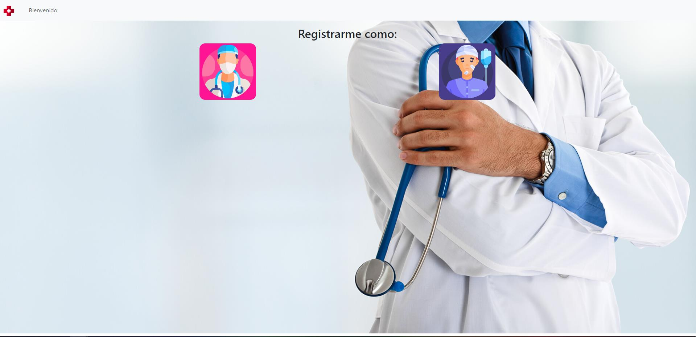
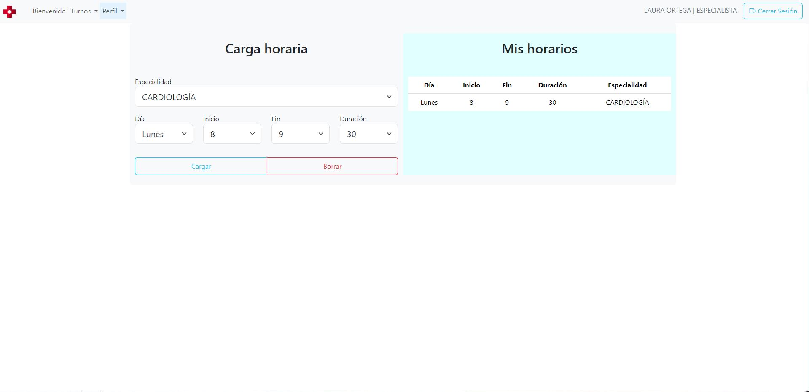

# Páginas comunes a todos los usuarios y no usuarios
## Página bienvenido

## Página login

## Página de registro

> Puede elegir registrarse como especialista o paciente.

### Página de registro especialista

### Página de registro paciente

# Administrador
## Página mi perfil

## Página solicitar turno

1. Elige un paciente
2. Elige una especialidad
3. Elige un especialista
4. Elige un turno (si es que existe)

## Página administrar usuarios

El admin puede
1. Ver información de los usuarios
1. Aceptar o rechazar a los especialistas
1. Agregar un nuevo especialista, paciente o administrador

# Paciente
## Página mi perfil

## Página solicitar turno

1. Elige una especialidad
2. Elige un especialista
3. Elige un turno (si es que existe)

# Especialista
## Página mi perfil

> Tiene la posibilidad de entrar a mis horarios a cargar su disponibilidad

## Página mis horarios

1. Elige especialidad
2. Elige dia
3. Elige hora de inicio
4. Elige hora finalización
5. Elige duración
